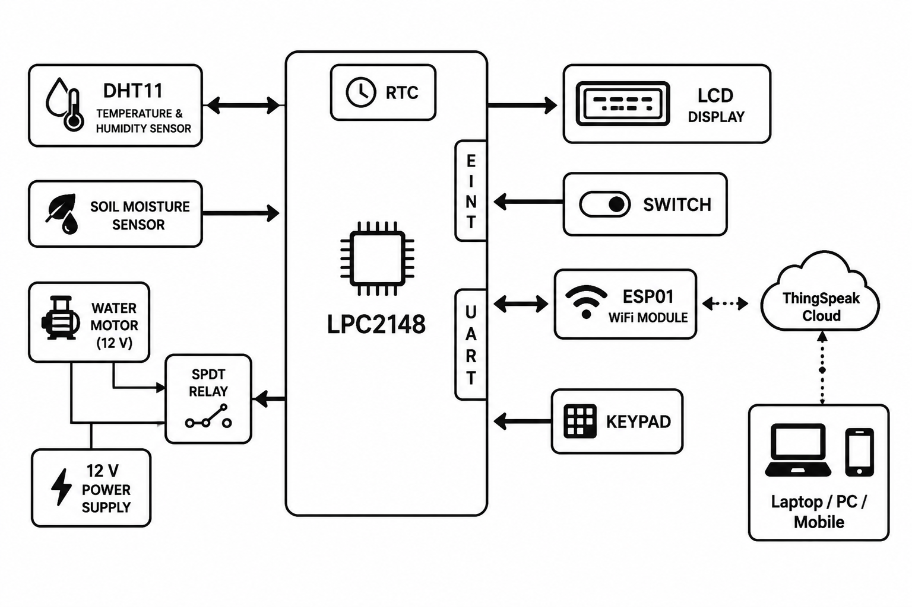

# 🌱 Smart IoT Irrigation System

Automated, sensor-driven irrigation built on the **LPC2148 (ARM7)** microcontroller — reads live environmental data, makes an on-device decision about watering, and streams everything to the cloud in real time.


---

## 📖 Overview

Manual irrigation wastes water and guesses at soil conditions instead of measuring them. This project closes the loop: soil moisture and ambient temperature/humidity are sensed continuously, the microcontroller decides when — and for how long — to run the pump, and every action is logged to **ThingSpeak** so the system can be monitored remotely from a laptop or phone.


## 🧩 Block Diagram



| Component | Role |
|---|---|
| LPC2148 (ARM7) | Central controller — sensor reads, decision logic, I/O |
| DHT11 | Temperature & humidity sensing |
| Soil Moisture Sensor | Primary irrigation trigger (digital/analog) |
| RTC | Timekeeping for scheduled cloud uploads |
| ESP01 | Wi-Fi bridge to ThingSpeak (UART) |
| 16x2 LCD | Local real-time display |
| 4x4 Keypad + Switch | Manual RTC configuration via interrupt |
| SPDT Relay + 12V Supply | Pump switching (LED substitute for demo) |

## 🛠️ Hardware Requirements

- LPC2148 development board
- DHT11 temperature & humidity sensor
- 16x2 LCD
- ESP01 Wi-Fi module
- Soil moisture sensor
- DB-9 cable / USB-UART converter
- SPDT relay, 12V supply, water pump (or LED for demo)

 
## Hardware Connections

| Component                           | LPC2148 Pin   |
| ----------------------------------- | ------------- |
| LCD Data Pins (D0–D7)               | P0.8 – P0.15  |
| 4×4 Keypad                          | P1.16 – P1.23 |
| Soil Moisture Sensor                | P0.21         |
| Water Pump/Motor (via Relay Driver) | P0.20         |
| DHT11 Temperature & Humidity Sensor | P0.23         |
| Interrupt Switch                    | P0.3 (EINT1)  |
| UART TX                             | P0.1 (TXD0)   |
| UART RX                             | P0.0 (RXD0)   |

## Overview of Hardware


## 💻 Software Requirements

- Keil µVision (C Compiler)
- Flash Magic (firmware flashing)
- Embedded C
- ThingSpeak account (free tier)


## Working Process

- Power ON the system. The LPC2148 initializes all peripherals.
-  The LCD turns ON and displays the project name or initialization message.
- The ESP01 Wi-Fi module is initialized by sending AT commands (AT, ATE0, AT+CWMODE, AT+CWJAP, etc.).
   After the ESP01 successfully connects to the Wi-Fi network, the system starts normal operation.
- The RTC reads the current date and time and displays it on the LCD.
- The DHT11 sensor measures the temperature and humidity.
- The soil moisture sensor measures the moisture level of the soil.
- The LPC2148 displays the sensor values and time on the LCD.
- If the soil moisture value is below the preset threshold, the LPC2148 turns ON the relay, which starts the 12 V       water    motor.
-  When the soil moisture reaches the required level, the relay turns OFF the water motor automatically.
-  The sensor data (temperature, humidity, soil moisture, and motor status) is sent to the ThingSpeak Cloud through the     ESP01 using UART communication.
-  The uploaded data can be monitored from a mobile phone, laptop, or PC using the ThingSpeak dashboard.

This sequence matches the actual execution flow of your code:
Power ON → LCD Initialization → ESP01 AT Commands → Wi-Fi Connection → RTC → Sensor Reading → LCD Display → Motor Control → ThingSpeak Data Upload.

## ⚙️ How It Works

1. **DHT11** reads temperature and relative humidity; values are displayed on a 16x2 LCD in real time.
2. **Soil moisture sensor** continuously checks soil condition (digital or analog output).
3. **Decision logic** on the LPC2148:
   - Soil moisture is the **primary** trigger — if it's low, the pump turns on.
   - Temperature acts as a **modifier**:
     - Dry soil + high temperature → pump runs **3 minutes**
     - Dry soil + normal/low temperature → pump runs **1 minute**
   - Soil moist → pump stays off.
4. **RTC** timestamps sensor readings and gates how frequently data is pushed to the cloud.
5. **ESP01 Wi-Fi module** (driven over UART) pushes temperature, humidity, and pump ON/OFF events to **ThingSpeak**, viewable live from any laptop/PC/mobile.
6. A **4x4 matrix keypad + interrupt switch** let the user manually edit RTC time via a menu-driven interface.

> 💡 A LED is used in place of the actual water pump/motor for safe demonstration — swap in a relay + 12V pump for a real deployment.


## 📊 Results

*(Add a screenshot of your ThingSpeak dashboard here, and a short demo GIF/video of the LCD + pump reacting to soil moisture changes.)*

```
docs/thingspeak_dashboard.png
media/demo.gif
```

## 🔭 Future Scope

- Replace ESP01 with ESP32 for combined sensing + Wi-Fi on one chip
- Add a mobile app / dashboard for manual override
- Multi-zone irrigation with per-zone moisture thresholds
- Solar-powered standalone field deployment
